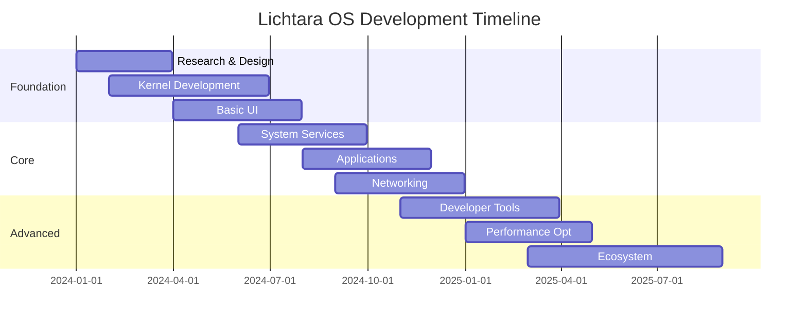

# Roadmap de Desenvolvimento

## Timeline Geral

## Fases de Desenvolvimento

### 🏗️ Fase 1: Foundation (Q1-Q2 2024)

**Objetivo**: Estabelecer base sólida do sistema

#### Marcos Principais
- **M1.1**: Kernel básico bootável
- **M1.2**: Sistema de arquivos funcional
- **M1.3**: Interface gráfica mínima
- **M1.4**: Drivers essenciais (teclado, mouse, display)

#### Entregáveis
- [x] Documento de arquitetura
- [ ] Kernel microkernel básico
- [ ] Boot loader
- [ ] Sistema de janelas primitivo
- [ ] Shell básico

### ⚙️ Fase 2: Core Features (Q3-Q4 2024)

**Objetivo**: Funcionalidades essenciais de um OS moderno

#### Marcos Principais
- **M2.1**: Sistema de janelas completo
- **M2.2**: Aplicações nativas básicas
- **M2.3**: Networking stack
- **M2.4**: Subsistema de áudio/vídeo

#### Entregáveis
- [ ] Window manager avançado
- [ ] Browser web nativo
- [ ] Editor de texto
- [ ] Terminal avançado
- [ ] File manager
- [ ] Media player

### 🚀 Fase 3: Advanced Features (Q1-Q2 2025)

**Objetivo**: Diferenciação e recursos avançados

#### Marcos Principais
- **M3.1**: Sistema de personalização
- **M3.2**: Developer toolchain
- **M3.3**: Performance optimizations
- **M3.4**: Security hardening

#### Entregáveis
- [ ] Theme engine
- [ ] IDE integrado
- [ ] Package manager
- [ ] Virtualization support
- [ ] Advanced security features

### 🌐 Fase 4: Ecosystem (Q3-Q4 2025)

**Objetivo**: Ecossistema completo e adoção

#### Marcos Principais
- **M4.1**: App store/marketplace
- **M4.2**: Enterprise features
- **M4.3**: Cloud integration
- **M4.4**: Stable release

#### Entregáveis
- [ ] Application marketplace
- [ ] Enterprise management tools
- [ ] Cloud sync services
- [ ] Migration tools
- [ ] Documentation completa

## Prioridades por Trimestre

### Q1 2024: Research & Foundation
- Finalizar especificações técnicas
- Estabelecer toolchain de desenvolvimento
- Começar desenvolvimento do kernel

### Q2 2024: Core Development
- Kernel básico funcional
- Sistema de arquivos
- Drivers básicos

### Q3 2024: User Interface
- Window manager
- Aplicações essenciais
- Input/output systems

### Q4 2024: Integration
- Networking
- Media support
- Alpha release

### Q1 2025: Polish & Performance
- Otimizações de performance
- Bug fixes
- UI/UX improvements

### Q2 2025: Advanced Features
- Developer tools
- Advanced customization
- Beta release

### Q3 2025: Ecosystem
- App marketplace
- Third-party integration
- Release candidate

### Q4 2025: Launch
- Stable release
- Documentation
- Community support

## Dependências Críticas

### Hardware Support
- Modern x86_64 architecture
- UEFI boot support
- Graphics drivers (Intel, AMD, NVIDIA)

### External Libraries
- LLVM/Clang toolchain
- Mesa graphics stack
- Audio frameworks

### Team & Resources
- Core development team (5-7 pessoas)
- UI/UX designers (2-3 pessoas)
- QA testers (2-3 pessoas)
- Technical writers (1-2 pessoas)

## Riscos e Mitigações

| Risco | Probabilidade | Impacto | Mitigação |
|-------|---------------|---------|-----------|
| Hardware compatibility | Média | Alto | Extensive testing program |
| Developer adoption | Alta | Alto | Strong documentation & tools |
| Performance issues | Média | Médio | Continuous benchmarking |
| Security vulnerabilities | Baixa | Alto | Security audits & reviews |
